# 📘 브리즈 CRM 직원 매뉴얼 (자동 생성 · 버전 2026-09-08 14:00)

> 이 문서는 `node tools/build-guide.js` 가 **index.html 의 실제 메뉴·화면 제목·설명(GUIDE_TEXT)·캡처**에서 만듭니다.
> 화면 구성이 바뀌면 검산(`node tests/run.js guide`)이 다시 만들고, 앱 안의 [📘 이용 가이드] 메뉴도 같은 내용을 실시간으로 보여줍니다.
> 단계: **P0** 운영 중 · **P1** 검증 후 공개(대표가 [직원에게 공개]) · **P2** 예정(로드맵에 유지)

## 그림으로 보는 흐름

### 하루 흐름

```mermaid
flowchart LR
  S0["📊 홈<br>오늘 할 일"]
  S1["👥 인입함<br>새 문의"]
  S2["🎯 매칭<br>문자 보내기"]
  S3["📍 임장<br>체크인·평가"]
  S4["📝 계약서<br>⚖ 점검"]
  S5["💰 정산<br>월말"]
  S0 --> S1 --> S2 --> S3 --> S4 --> S5
```

### 전화가 오면

```mermaid
flowchart LR
  S0["📱 벨<br>(웹훅)"]
  S1["☁ 서버<br>callRing"]
  S2["💻 화면<br>📞 카드"]
  S3["👥 카드 열기<br>또는 고객 등록"]
  S0 --> S1 --> S2 --> S3
```

### 매물 검수

```mermaid
flowchart LR
  S0["🏠 매물 등록<br>대장 자동조회"]
  S1["🧹 검수 실행<br>중복·호수·외부망"]
  S2["✅ 검증 도장<br>(대표)"]
  S3["🗺 직원 화면<br>깨끗한 매물만"]
  S0 --> S1 --> S2 --> S3
```

## 화면별 안내 (왼쪽 메뉴 순서)

### 1 · 대표실 · 통합 보고·지시·승인

#### 1. 📊 홈 대시보드  `P0 운영`

- **무엇**: 맨 위 6개 모듈 카드(매물·고객·협업·계약재무·경영·검수)로 회사 전체를 한눈에 — 대표와 직원이 서로 다른 화면을 봅니다
- **언제**: 출근하면 제일 먼저
- **순서**: 1) 위쪽 띠에서 오늘 할 일 확인(대표: 위험·검수·만기 / 직원: 임장·연락·근태) → 2) 모듈 카드를 눌러 그 업무로 바로 이동 → 3) 아래 숫자·주간 지표·일정 확인
- 💡 모듈 카드는 누르면 해당 메뉴로 갑니다 · 직원 화면에는 회사 전체 금액 대신 본인 것만 보입니다

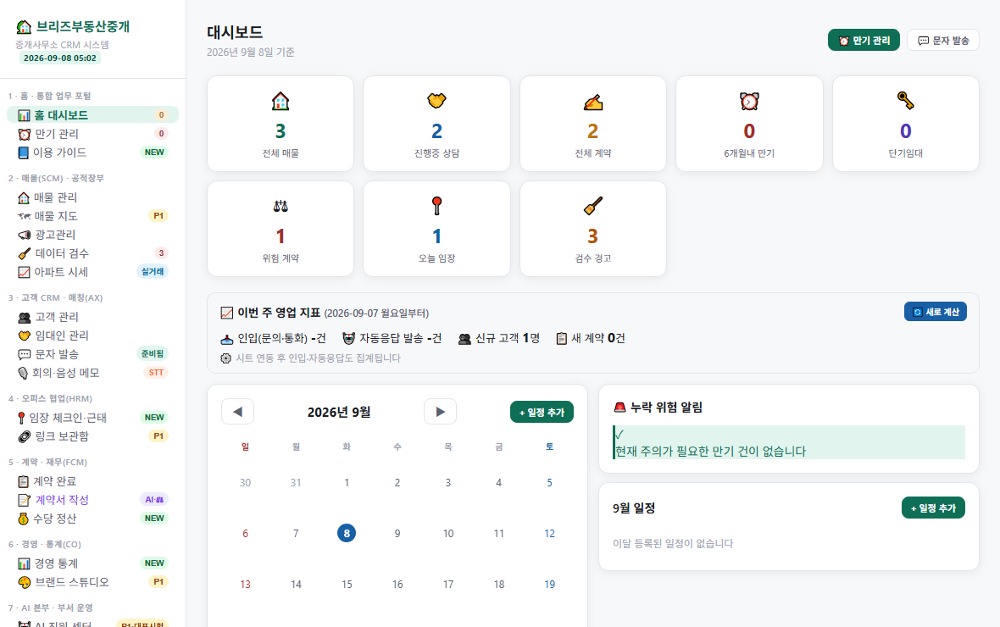

#### 2. 📊 경영 통계  `P0 운영`

_계약·보수·고객·임장·광고·이상거래를 한 달 단위로_

- **무엇**: 월별 계약·보수·고객·임장·광고·이상거래
- **언제**: 월말 · 주간 회의
- **순서**: 1) 달 선택 → 2) 타일 읽기

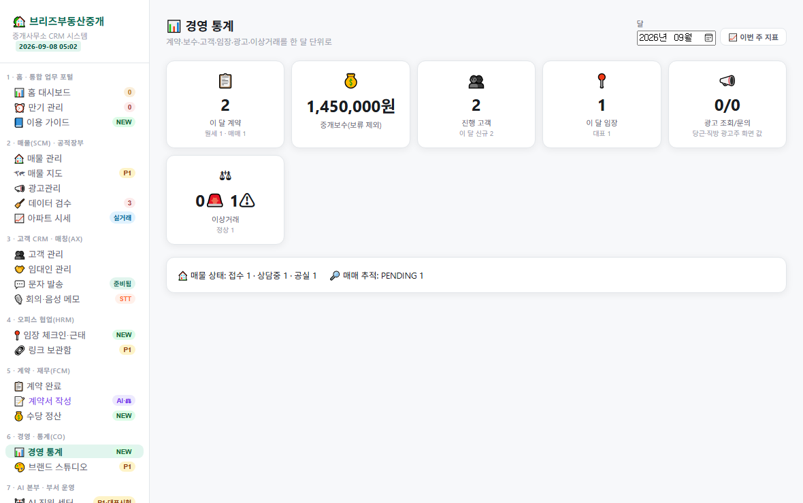

### 2 · 관리부 · 인사·회계·결재

#### 3. ⏰ 계약 만기 관리  `P0 운영`

_6개월 이내 만기 계약_

- **무엇**: 계약 만기 D-day와 연장/종료 확정
- **언제**: 매주 월요일 · 만기 30일 전
- **순서**: 1) 만기 순으로 보기 → 2) 연락 완료 표시 → 3) 연장/종료 확정
- 💡 확정 내역은 시트에 저장되어 폰·PC가 같습니다

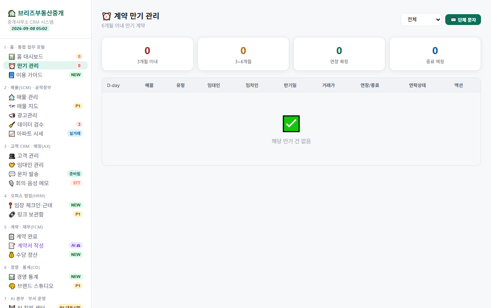

#### 4. 💰 수당 정산  `P0 운영`

_계약별 중개보수 → 배분율 → 세후 지급 예정. 이상거래 RED·해제 건은 보류_

- **무엇**: 계약별 중개보수 → 공동중개 몫 → 담당자 요율 → 세후
- **언제**: 월말
- **순서**: 1) 달 선택 → 2) 중개보수 입력(제안값 회색) → 3) 공동중개면 사무소명·우리 몫 % → 4) 에스크로·입금일
- 💡 배분율·세율·담당자 요율은 대표만(사무소 공통)

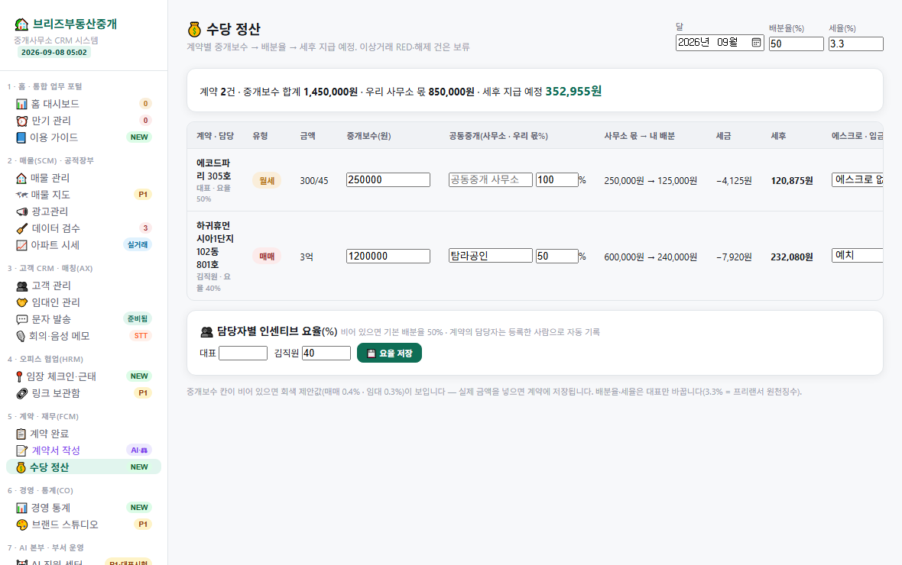

#### 5. 👥 직원 관리  `P0 운영` `대표 전용`

_직원 계정을 만들고 접속 링크를 보냅니다 — 링크를 열면 그 기기가 바로 연결됩니다 (대표 전용)_

- **무엇**: 직원 계정 발급·링크·삭제(대표 전용)
- **언제**: 직원 입사·퇴사
- **순서**: 1) 이름 → [＋ 계정 발급] → 2) 링크를 그 직원에게만 → 3) 퇴사 시 삭제
- 💡 링크 = 열쇠

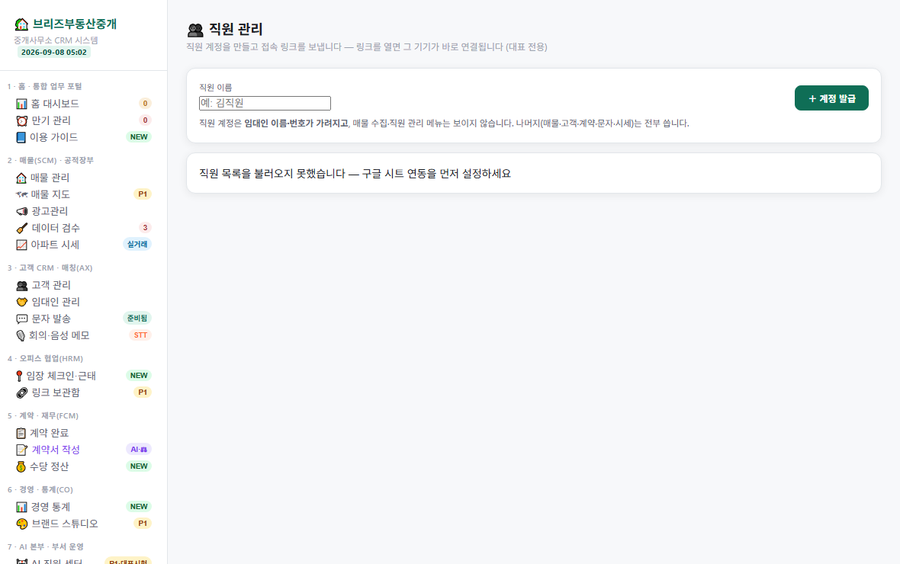

### 3 · 운영부 · 영업·매물·계약

#### 6. 🏠 매물 관리  `P0 운영`

- **무엇**: 매물 등록·수정, 건축물대장 자동조회, 사진
- **언제**: 매물 접수 즉시
- **순서**: 1) 주소 입력 → 상세주소(호수) → 2) [🏢 대장 자동조회] — 총층·승인일·면적·구조·내진 → 3) 거래유형·가격·입주일 → 4) 저장(자동으로 시트에)
- 💡 🔒 미검증 표시는 대표 검수 전 — 연락처가 가려집니다 · 🔄 수명주기: 접수→검증→광고→임장→계약

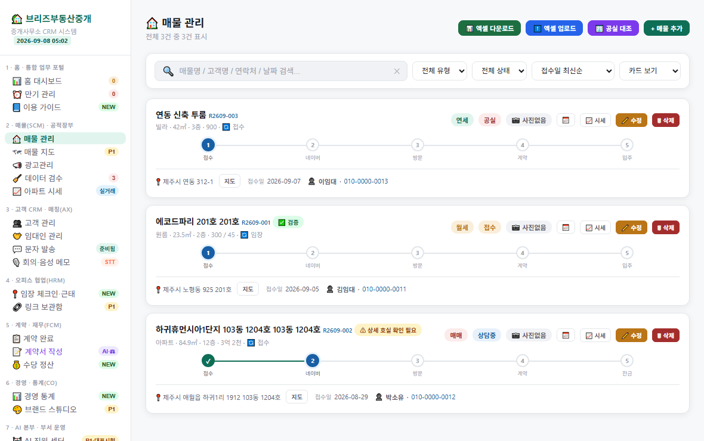

#### 7. 🗺 매물 지도  `P1 예정(검증 후 공개)`

_검증 통과 매물을 지도에 표시합니다 · 위치는 주소로 자동 계산_

- **무엇**: 검증 통과 매물을 지도에 핀으로
- **언제**: 손님 상담·임장 동선 짤 때
- **순서**: 1) [📍 위치 계산] 한 번(주소→좌표) → 2) 핀 클릭 → 매물 열기
- 💡 직원 화면은 검증 통과 매물만 보입니다

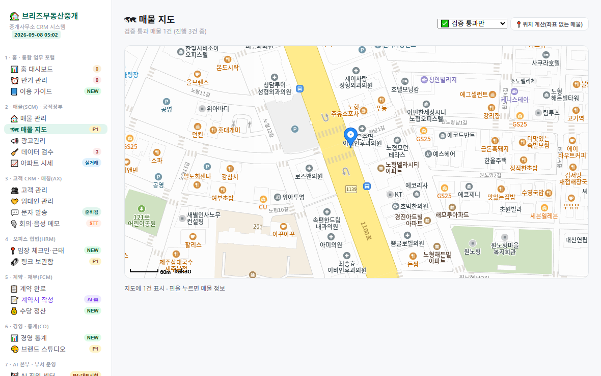

#### 8. 👥 고객 관리  `P0 운영`

- **무엇**: 손님 등록·매칭률 %·문자·인입함
- **언제**: 문의 오면 바로
- **순서**: 1) [인입함] 새 문의 → 고객으로 전환 → 2) 조건 입력 → 🎯 매칭 매물 → 3) [📤 문자로 보내기] → 4) 다음 연락일 채우기
- 💡 전화가 오면 📞 카드가 뜹니다 — [고객 카드 열기]

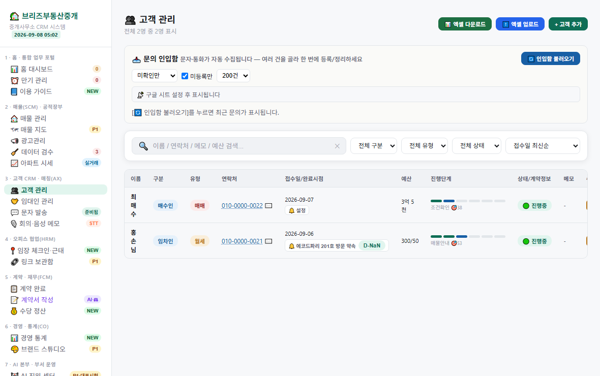

#### 9. 🤝 임대인 관리  `P0 운영`

- **무엇**: 임대인 연락 주기·공실 확인
- **언제**: 공실 확인 전화 돌릴 때
- **순서**: 1) 다음 연락일 순으로 → 2) 통화 후 메모·다음 날짜
- 💡 직원에겐 이름·번호 일부가 가려집니다(본인 등록분 제외)

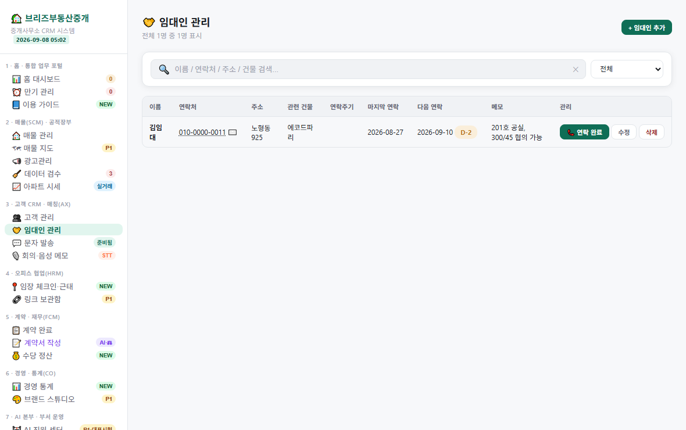

#### 10. 💬 문자 자동 발송  `P0 운영`

- **무엇**: 문자·알림톡 발송(검토→승인→발송)
- **언제**: 매물 안내·공실 확인
- **순서**: 1) 대상 선택 → 2) 미리보기 → 3) 승인 후 발송
- 💡 자동 발송은 없습니다 — 사람이 누릅니다

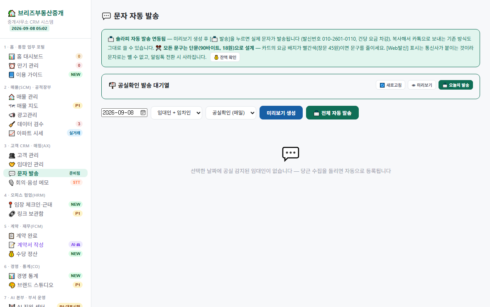

#### 11. 🎙️ 회의 녹음 · 빠른 음성 메모  `P0 운영`

_회의는 바로 녹음하고, 짧은 말은 곧바로 고객 메모로 남깁니다_

- **무엇**: 회의 녹음·빠른 음성 메모 → 고객 메모
- **언제**: 회의·이동 중
- **순서**: 1) 녹음 → 2) 텍스트 확인 → 3) 고객 메모로
- 💡 음성 원본은 기기에만

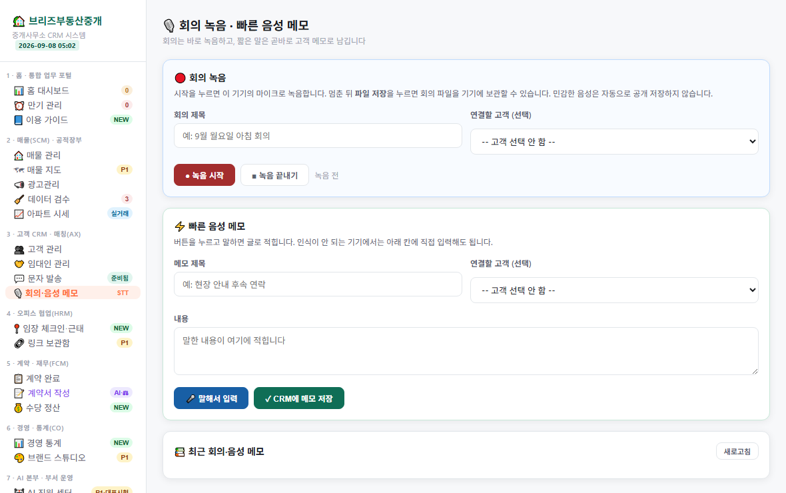

#### 12. 📍 임장 체크인 · 근태  `P0 운영`

_현장에서 체크인하고 평가를 남기면 고객 카드에 바로 반영됩니다 ·_

- **무엇**: 출근/복귀 · 임장 체크인/체크아웃(GPS) · 현장 평가
- **언제**: 현장 나갈 때마다
- **순서**: 1) 출근 스탬프 → 2) 매물·고객 고르고 [📍 체크인] → 3) 반응·가능성·메모 저장(고객 카드에 자동) → 4) [🏁 체크아웃] → 체류 시간
- 💡 폰 위치 권한 허용

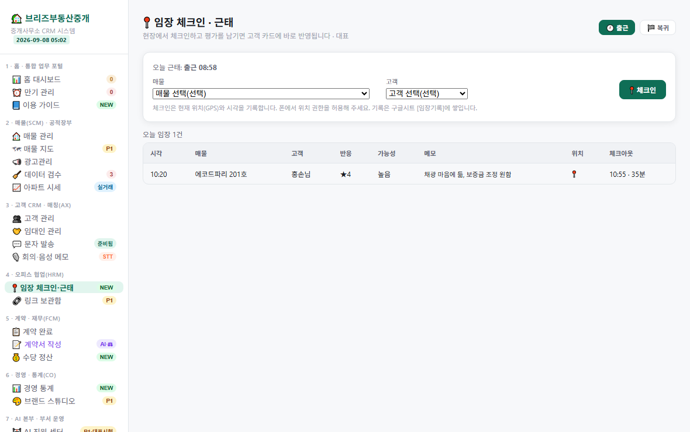

#### 13. 📋 계약 완료 현황  `P0 운영`

- **무엇**: 계약 등록·만기·⚖ 이상거래 배지·매매 추적
- **언제**: 계약 성사 직후
- **순서**: 1) 매물에서 계약완료 → 자동 생성 또는 직접 등록 → 2) 임대인·임차인·기간
- 💡 🚨 RED 는 대표 확인 후

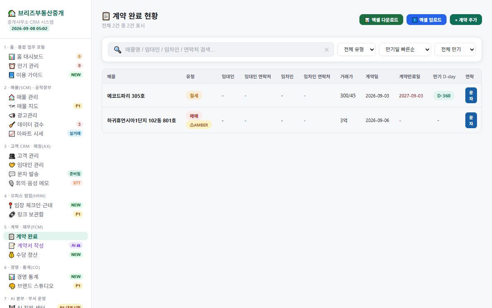

#### 14. 📝 계약서 / 확인설명서 작성  `P0 운영`

_계약 유형 선택 → 서류 첨부 → AI 자동 추출 → 계약서 + 확인설명서 동시 생성_

- **무엇**: 계약서·확인설명서 자동 생성 + 이상거래 자동 점검
- **언제**: 계약 직전
- **순서**: 1) 매물·고객 선택 → 2) [공부 추출]로 대장 값 채움 → 3) ⚖ 배너 확인 → 4) [📋 계약완료에 등록]
- 💡 배너는 참고자료(법적 판단 아님)

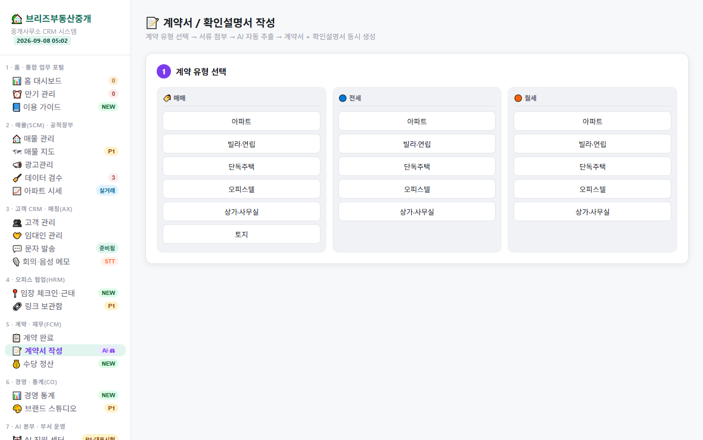

#### 15. 📈 아파트 실거래가  `P0 운영`

_국토교통부 신고 실거래 — 매매·전세·월세 조회와 시세 추이_

- **무엇**: 국토부 실거래가 조회·추이
- **언제**: 가격 상담·계약서 쓰기 전
- **순서**: 1) 지역·단지 선택 → 2) 매매/전세/월세 표 → 3) 추이 그래프
- 💡 전국 가능, 기본 제주

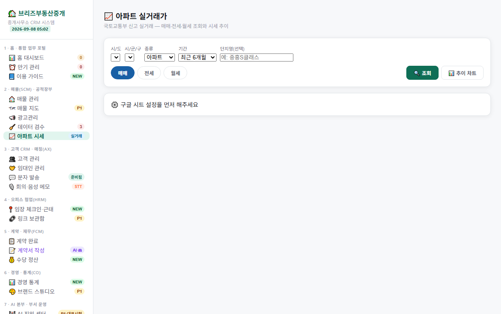

#### 16. 🥕 매물 수집  `P0 운영` `대표 전용`

_당근부동산 · 제주오일장에서 제주시 매물을 받아옵니다 (대표 전용)_

- **무엇**: 당근·오일장 매물 자동 수집(대표 전용)
- **언제**: 주 1~2회
- **순서**: 1) [수집 시작] → 2) 중복 대조 결과 보기 → 3) 임대인 이관
- 💡 수집 중에도 다른 기능은 그대로 됩니다

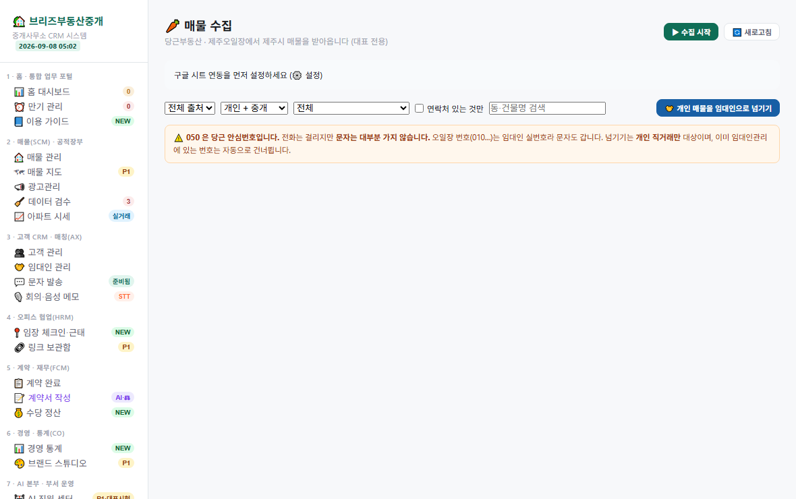

### 4 · 마케팅부 · 광고·콘텐츠

#### 17. 📣 광고관리  `P0 운영`

- **무엇**: 광고 원장(당근·네이버·블로그)·홈페이지 노출 스위치
- **언제**: 광고 올릴 때·내릴 때
- **순서**: 1) 플랫폼 켜기/끄기 → 2) 광고번호·URL 기록 → 3) 조회/문의 숫자 옮겨 적기
- 💡 당근은 삭제 후 재등록 금지 — 수정 또는 거래완료로

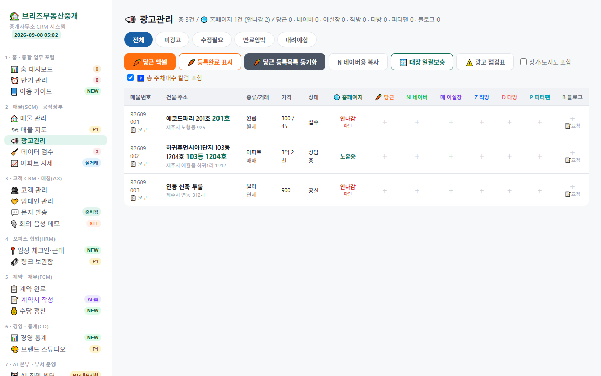

#### 18. 🔗 링크 보관함  `P1 운영`

_카톡 대화 내보내기(kakao.txt)를 올리면 링크·날짜·보낸이를 뽑아 제목까지 붙여 저장합니다 · 노션 연동: 확인 중_

- **무엇**: 카톡 대화 내보내기(kakao.txt)의 링크를 제목·날짜·보낸이로 보관
- **언제**: 단톡방 자료 정리할 때
- **순서**: 1) 카톡 → 대화 내보내기 → 파일 선택 → 2) 미리보기 확인 → [💾 저장] → 3) (대표) 노션 DB 연동 시 노션에도
- 💡 같은 링크는 한 번만 저장

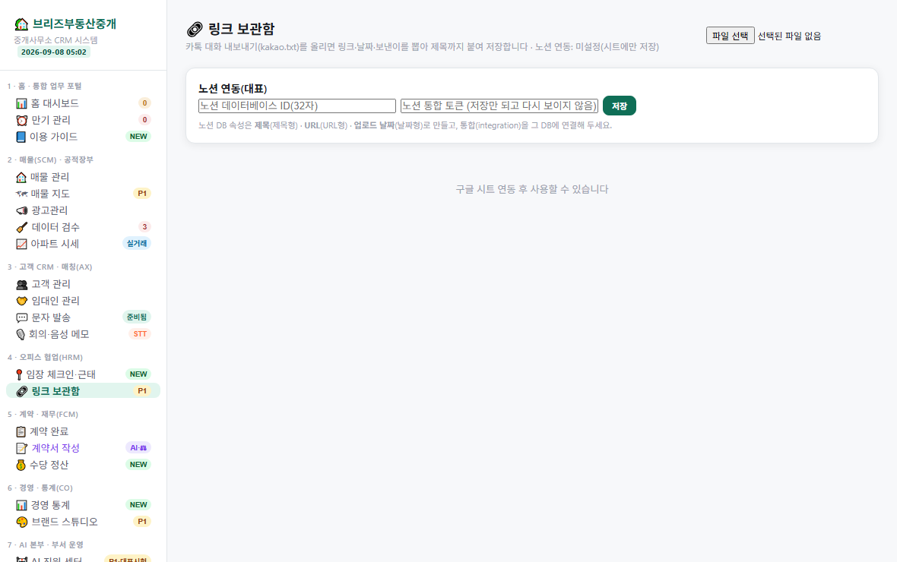

### 5 · 개발부 · 시스템·검산·배포

#### 19. 🧹 데이터 검수  `P0 운영`

_중복 매물 · 호수 누락 · 대장 미조회 · 외부 공실망(당근·오일장) 내려감 — 직원에겐 검증 통과 매물만 온전히 보입니다_

- **무엇**: 중복 매물·호수 누락·대장 미조회·외부 공실망 내려감을 서버가 대조
- **언제**: 매일 아침 1번(대표) · 매물 많이 넣은 뒤
- **순서**: 1) [🔍 검수 실행] → 2) 경고 매물 열어서 고치기 → 3) 대표: [✅ 검증 도장] → 직원 화면에 깨끗한 매물만 → 4) 대표: [🧹 중복 정제]는 확인 후
- 💡 소유자 대조는 공개 API에 없어 등기부(유료)로만 가능

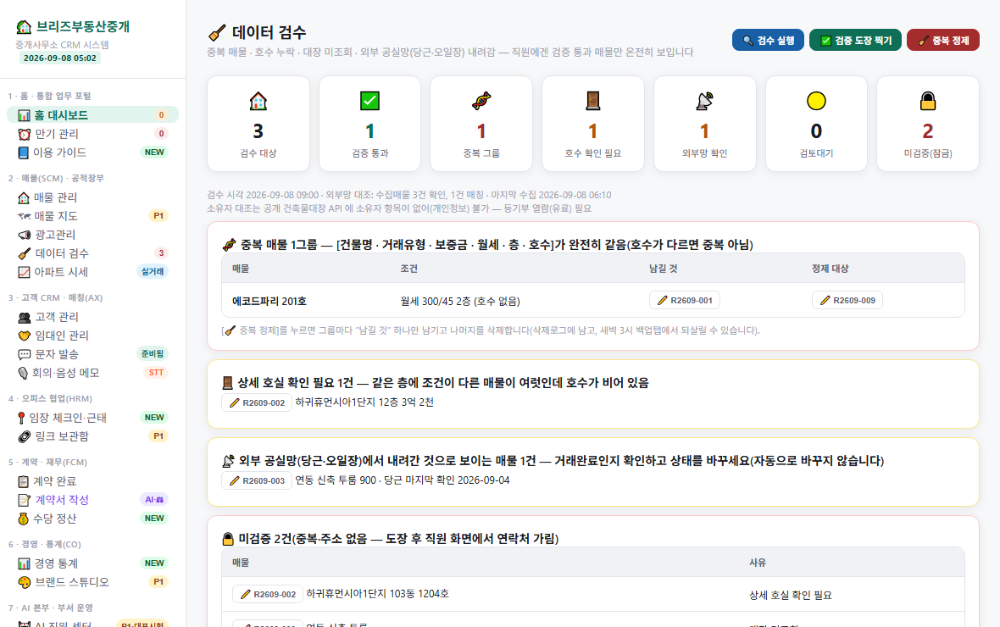

#### 20. 🤖 AI 직원 센터  `P1 예정(검증 후 공개)`

_한 회사 데이터 위에서 부서별 역할·권한을 나누는 대표 지휘 화면_

- **무엇**: 관리·운영·마케팅·개발부와 계열사의 AI 업무 초안·권한·승인을 한곳에서 관리
- **언제**: 대표 지시·매일 업무 취합
- **순서**: 1) 부서 선택 → 2) 접근 데이터·담당 업무 확인 → 3) 업무 지시 초안 저장 → 4) AI 결과 검토 후 사람이 승인
- 💡 계약·금전·삭제·외부발송·배포는 AI 단독 실행 금지 · 현재 P1 대표시험: AI로 전송하지 않음

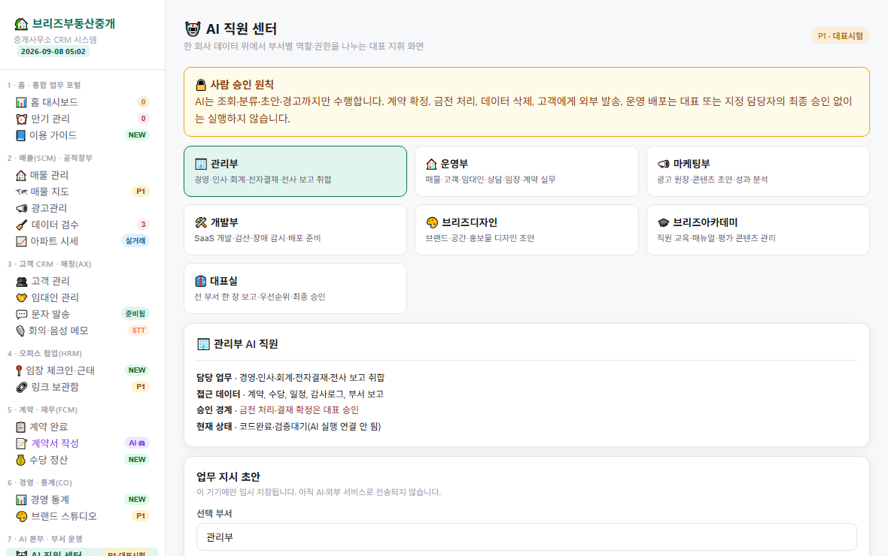

### 6 · 브리즈디자인 · 브랜드(계열사)

#### 21. 🎨 브랜드 스튜디오  `P1 예정(검증 후 공개)`

_캐릭터·로고·색상·굿즈 자산을 한곳에서 — 초안 → 검토대기 → 대표 승인 → 사용_

- **무엇**: 캐릭터·로고·색상·굿즈 시안을 한곳에서 관리 — 초안 → 검토대기 → 대표 승인 → 사용
- **언제**: 광고·블로그·굿즈를 만들기 전
- **순서**: 1) [＋ 자산 등록]으로 파일 올리기(6MB 이하) 또는 링크 붙이기 → 2) 분류·캐릭터·버전 적기 → 3) 대표가 [승인]으로 바꾸기 → 4) 쓴 곳을 [📌 사용처 기록]
- 💡 승인된 자산만 대외에 씁니다 · 캐릭터 이름·고정 특징은 [🧍 캐릭터 기준표]에서 대표가 정합니다 · 파일 원본은 구글드라이브 [브리즈_브랜드스튜디오] 폴더

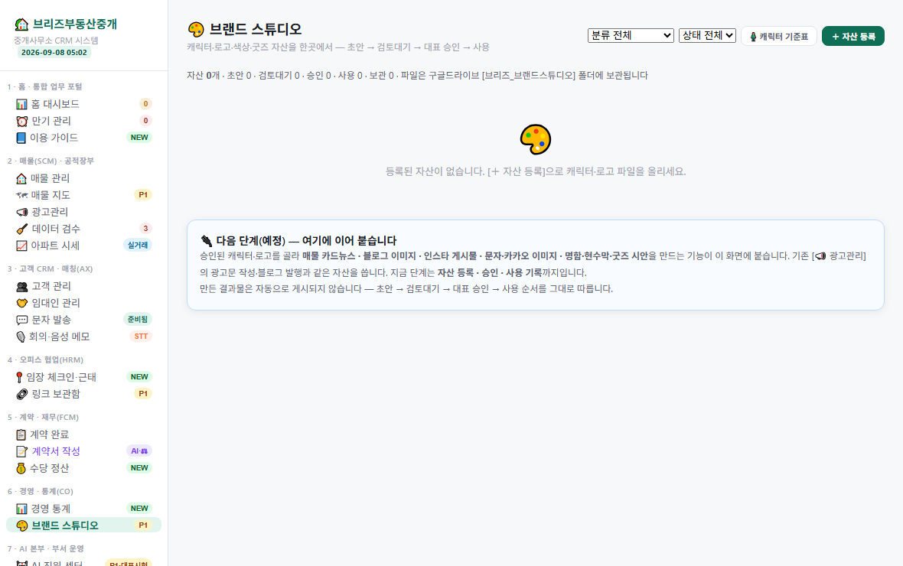

### 7 · 브리즈아카데미 · 교육(계열사)

#### 22. 📘 이용 가이드 · 직원 매뉴얼  `P0 운영`

_화면 구성이 바뀌면 이 가이드도 자동으로 따라갑니다 (메뉴 순서 = 읽는 순서)_

- **무엇**: 이 매뉴얼 — 화면 구성이 바뀌면 자동으로 따라갑니다
- **언제**: 첫날 · 새 기능이 생겼을 때
- **순서**: 1) 메뉴 순서대로 읽기 → 2) 🖨 인쇄해 책상에
- 💡 P0=운영 중, P1=검증 후 공개, P2=예정

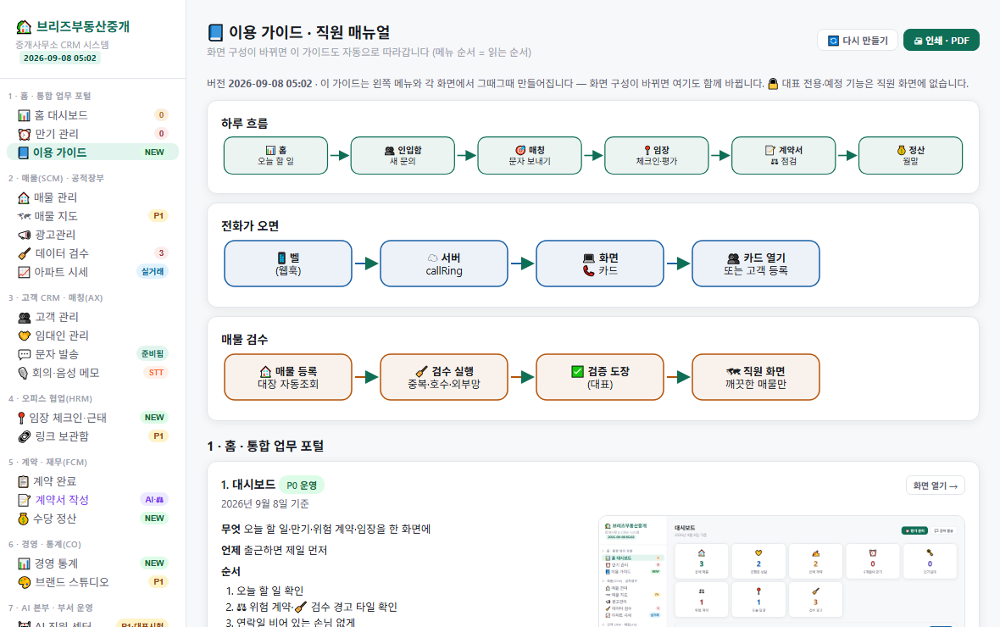

- **🧮 계산기** — 계산기(취득세·양도세·중개보수·대출)
## 📌 예정(P2) — 버리지 않고 로드맵에 남긴 기능

- **전자서명(모두싸인·위드싸인)** — 상용 계약·과금 필요 — 계약서 작성기는 준비됨
- **온하우스 실제 공실망 연동** — 공개 API 없음 — 지금은 당근·오일장 수집분으로 대조
- **소유자 대조(등기부)** — 공개 건축물대장 API에 소유자 없음 — 등기부 열람(유료) 연동 시
- **노션 → 깃허브 문서 자동 동기화** — 저장소에 준비됨(docs-sync.yml) — 깃허브 비밀값 2개 등록 후 작동
- **광고비 배부·ROI / KPI·MBO / 급여·퇴직 / 메신저·전자결재 / 벌점** — 소규모 사무소엔 과잉 — 직원 늘면 단계별
- **매물까지 거리 표시(임장)** — 좌표(🗺 위치 계산) 쌓인 뒤
- **페르소나(대표/직원) 완전 분리 대시보드** — 지금은 타일·마스킹으로 구분

## 막히면

- "불러오기 0건" → 그 기기에 접속 링크를 다시 열기(토큰 재설정)
- 화면이 옛날 같으면 → 왼쪽 위 날짜 버전을 눌러 새 버전 확인
- 전화 카드가 안 뜨면 → ⚙️ 설정 → [전화 실시간 팝업] 체크 · 폰 웹훅(callRing) 설정 확인
- 그래도 안 되면 대표님께 (00_대표대시보드.md 와 이 문서를 Claude 에게)
